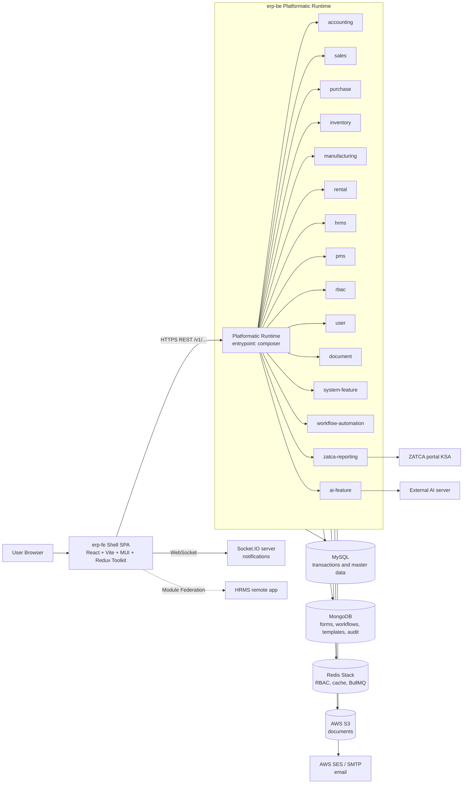
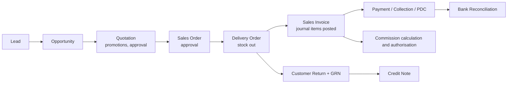
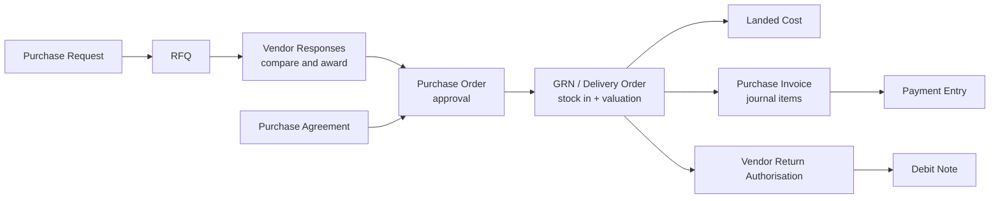
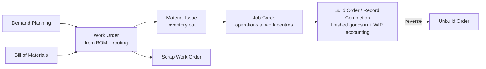
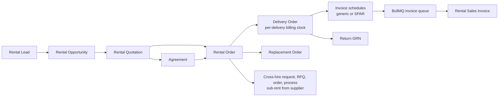
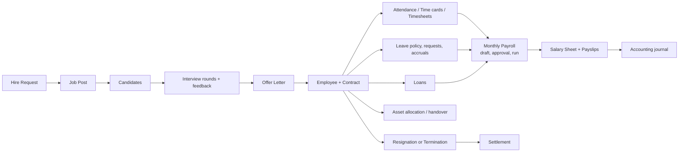

# ERPForce: Complete Project Documentation

Scope: `erp-be` (backend) and `erp-fe` (frontend), folder `erp-latest`.
Perspective: Business Analyst, Solution Architect and Full Stack Developer.
Basis: everything in this document was read from the code in the two folders (routes, controllers, services, entities, crons, route constants, package manifests and the in-repo README and AGENTS guides). The system is treated as fully working; this document describes what exists.

---

## Table of Contents

1. Executive Summary
2. System at a Glance
3. Repository Layout
4. Backend Architecture (erp-be)
5. Backend Business Modules
6. Frontend Architecture (erp-fe)
7. Frontend Business Modules and Screens
8. End-to-End Business Flows
9. Scheduled Jobs and Background Processing
10. Configuration, Environments and Deployment
11. Developer Guide (how to extend)
12. Glossary and Appendices

---

## 1. Executive Summary

ERPForce is a modular, multi-company ERP platform. It covers:

| Business area | Capability |
| --- | --- |
| Finance and Accounting | Chart of accounts, journals, sales and purchase invoices, payments, credit and debit notes, PDC, bank reconciliation, budgets, fixed assets and depreciation, commissions, multi-currency, tax (VAT), fiscal years, financial and VAT reports |
| Sales and CRM | Leads, opportunities, quotations, sales orders, delivery orders, customer returns, promotions and coupons, customer segments, shipping rules, forecasts |
| Procurement | Purchase requests, RFQ, purchase agreements, purchase orders, GRN, landed cost, vendor return authorisations (VRA), demand planning |
| Inventory | Items of 6 types, categories, attributes, UOM, warehouses and bins, stock transfer, bin transfer, adjustment, scrap, valuation, reservations |
| Manufacturing | Bill of materials, routing, operations, work centres, equipment, work orders, job cards, build and unbuild orders, gate register |
| Rental | Rental lead to invoice lifecycle, agreements, delivery and return, billing cycles, replacement orders, cross-hire (sub-renting from suppliers), recurring rental invoicing |
| HRMS | Employee lifecycle from recruitment to exit, attendance, timesheets, leave, loans, payroll and payslips, assets, resignations and terminations, settlements, reports |
| Projects (PMS) | Projects, tasks, cost codes, cost elements |
| Documents | Drive, shared drive, drive locations, activity trail |
| Platform | Multi-company RBAC, workflow and approval automation, form builder, templates, notifications, audit trail, translations, dashboards, AI copilot, ZATCA e-invoicing (KSA) |

Technically it is a Node.js/Fastify backend, run as a set of Platformatic services behind one runtime, with MySQL as the system of record, MongoDB for dynamic configuration, Redis for permissions, cache and queues, and a React/TypeScript/Vite single page application built from a shared component library and per-domain modules.

Size indicators taken from the code:

| Metric | Value |
| --- | --- |
| Backend business services (modules) | 16 (accounting, ai-feature, composer, document, hrms, inventory, manufacturing, pms, purchase, rbac, rental, sales, system-feature, user, workflow-automation, zatca-reporting) |
| REST endpoints registered in module controllers | about 2,500 (accounting 460, hrms 448, rental 401, sales 264, purchase 198, manufacturing 195, inventory 170, system-feature 74, rbac 49 and others) |
| MySQL repository/entity sets under `database/mysql` | 408 tables |
| MongoDB model sets | 23 (dashboard, form-builder, workflows, templates, translations and others) |
| Redis OM entities | 5 (role, permission, resource, entity-based-access, time-based-access) |
| Database migrations | 939 files in `erp-be/migrations` |
| Scheduled (recurring) jobs | 21 registered recurring jobs |
| Frontend business modules | 12 in `erp-fe/modules` plus the HRMS remote application |
| Shared UI library | `@erpsquad/common` with about 360 component entry points |
| Generated API clients | 14 clients in `erp-fe/api-client` |

---

## 2. System at a Glance



Key architecture facts:

* From the frontend, each service is reached as `<BACKEND_BASE_URL>/<module>/v1/...` (for example `/accounting/v1/banks`).
* One Platformatic runtime autoloads every folder under `erp-be/modules/*` as its own Fastify service. `composer` is the runtime entrypoint (see `platformatic.runtime.json`: `"entrypoint": "composer"`, autoload path `modules`).
* Each module has the same skeleton: `platformatic.service.json`, `plugins/`, `routes/`, `lib/<feature>/{controller,service,use-case,validator}`.
* The frontend "shell" hosts most domain modules inside a single Vite build through aliases, and loads HRMS as a real Module Federation remote.
* All tenant data is company aware (`company_id`), and access is decided by Redis-held roles, permissions and resources.

---

## 3. Repository Layout

```
erp-latest/
  erp-be/                          Backend
    platformatic.runtime.json      Runtime: entrypoint composer, autoload modules/
    modules/                       16 Platformatic services (business domains)
    packages/                      Shared code (db, queue, errors, utils, bootstrap, types)
    database/                      Data layer definitions
      mysql/<table>/{entity,repository}.js
      mongodb/<collection>/{model,schema}.js
      redis-om/<entity>/{entity,repository}.js
      data/                        Static seed data (countries, states, languages)
    migrations/                    939 SQL migrations (migrate.ts)
    seeder.ts, migrate.ts          Data lifecycle CLI
    scripts/                       Data import and utility scripts (employees, opening balance, stock transfer, hrms templates)
    docs/                          module-map.md, golden path example
    Dockerfile, docker-compose*.yaml, deployment.yaml, Jenkinsfile
  erp-fe/                          Frontend
    src/                           Shell: bootstrap, routes, redux, auth views, theme
    modules/                       Domain UI modules (accounting, inventory, ...)
    packages/common/               @erpsquad/common shared library
    api-client/                    Generated typed API clients (per backend module)
    api/api.openapi.json           Combined OpenAPI document
    apps/hrms/                     Host stub for the HRMS federated remote
    vite.config.ts                 Aliases, federation, shared singletons
    Dockerfile, Jenkinsfile, playbook.yaml
```

---

## 4. Backend Architecture (erp-be)

### 4.1 Technology stack

| Concern | Choice |
| --- | --- |
| Runtime | Node.js >= 22.19 (package engines), CommonJS modules |
| Framework | Fastify 4 through `@platformatic/service`, `@platformatic/composer`, `@platformatic/runtime` 3.5.x |
| SQL | MySQL via `@databases/mysql`, repository pattern over `packages/db/sql` |
| NoSQL | MongoDB (models under `database/mongodb`) |
| Cache / RBAC store | Redis Stack with `redis-om`; `ioredis`/`redis` clients |
| Queue and scheduler | BullMQ (`packages/queue`) with recurring jobs |
| Realtime | Socket.IO with Redis adapter (composer `socket.plugin.js`) |
| Auth | `@fastify/jwt`, token sent in `x-token` header |
| Files | `@fastify/multipart`, multer, AWS S3 (bucket from `DOCUMENT_BUCKET_NAME`) |
| Email | AWS SES v2 (`@aws-sdk/client-sesv2`) and nodemailer |
| Documents and reports | ExcelJS/xlsx, Puppeteer (HTML to PDF), pdf-lib, docx, handlebars/mustache templates |
| E-invoicing | ZATCA libraries (`@axenda/zatca`, x509, xmldsigjs, node-forge) |
| Numbers | decimal.js, expr-eval (formula engine), moment and moment-timezone |
| Quality | Jest 30 (`*.spec.js` beside services), ESLint, Husky, commitlint, standard-version |

### 4.2 Service model

Each module is an independent Platformatic service:

```
modules/<domain>/
  platformatic.service.json    OpenAPI on, CORS, plugin paths [./plugins, ./routes]
  index.js / global.d.ts
  plugins/                     auth, sql, mongo, redis, response handler, error handler,
                               sync.resource, multer/file upload, cron
  routes/                      one file per feature; registers versioned controllers with a prefix
  lib/<feature>/
    controller/v1/index.js     Fastify route declarations (schema, auth hook, transaction wrapper)
    controller/v1/controller.js  request extraction, calls use-case, replies
    use-case/v1/*.js           thin command/query classes
    service/*.service.js       business rules, repository calls, audit and activity logs
    validator/*.js             AJV request schemas
  crons/                       recurring jobs (BullMQ)
  templates/                   HTML/Excel templates for print and export
  test/                        integration tests
```

`modules/composer` is the runtime entrypoint. It configures CORS (allowed headers include `Authorization`, `x-token`, `x-timezone`, `file-size`), and provides shared plugins: `socket.plugin.js` (Socket.IO notifications), `timezone.plugin.js`, `validator.plugin.js`, `multer.plugin.js`, `global.error.handler.js`, and helpers `lib/requestContext.js`, `lib/preHandlerHook.js`, `lib/patchAudit.js`.

### 4.3 Layering pattern (the "golden path")

```
routes/<feature>.js              prefix: v1/<feature>
  -> lib/<feature>/controller/v1/index.js    route + schema + auth + transaction wrapper
    -> controller/v1/controller.js           extract request, userId, clientIp
      -> use-case/v1/<action>.js             orchestration
        -> service/<feature>.service.js      business rules, audit, activity log
          -> fastify.db.<Name>Repository     database/mysql/<table>/repository.js
            -> packages/db/sql/base.repository.js
```

Every route declares: `schema` (tags, body/query/params validator, response schema, headers), `preValidation: fastify.authenticate`, `preHandler: preValidateRequest`, and for writes a `withTransaction(fastify, request, reply, Controller, "method")` wrapper so header, lines, taxes, journal rows and logs commit or roll back together. Responses go through `reply.sendResponse(status, data, message)`.

Standard endpoint set per master or document feature (visible across the route inventory):

| Pattern | Meaning |
| --- | --- |
| `POST /v1/<x>` | create |
| `POST /v1/<x>/import` | Excel bulk import |
| `GET /v1/<x>` | paginated, filtered, sorted list |
| `GET /v1/<x>/:id` | detail |
| `PUT /v1/<x>/:id` | update |
| `DELETE /v1/<x>/:id` | (soft) delete |
| `POST /v1/<x>/add-approver`, `PUT /v1/<x>/approval-status/:id` | approval chain |
| `POST /v1/<x>/save-draft` | draft save |
| `GET /v1/<x>/generate-excel`, `/generate-pdf`, `/:id/download` | exports and print |
| `POST /v1/<x>/next-sequence`, `/check-uniqueness`, `GET /preview-series-number` | numbering and uniqueness helpers |

### 4.4 Data layer

**MySQL (system of record).** Each table has `database/mysql/<table>/entity.js` and `repository.js`.

* `entity.js` exports a `Schema` object. Each field defines `select` (qualified column), `alias`, `type`, and flags `isDefault`, `isFilterAllowed`, `isOrderAllowed`, `required`. This whitelist is what the generic query builder uses for filtering, sorting and field selection (no free-form column names reach SQL).
* `repository.js` extends `BaseRepository` (`packages/db/sql/base.repository.js`) which provides: `insertOne`, `insertMany`, `upsert`, `findOne`, `find`, `count`, `updateOne`, `softDelete`, `delete`, `execute`, `withTransaction`, `getUpdatedSchema(company_id)` (per-company dynamic field overlay), series-number generators and ID helpers.
* Query strings use a compact filter grammar such as `date.lte=2026-01-01&is_posted.eq=false` parsed by `query-parser.js` and `query.builder.js`.
* Tables are prefixed by domain: `sl_` (sales), `pr_` (purchase), `rn_` (rental), `mf_` (manufacturing), plain names for accounting, inventory, HRMS.

**MongoDB (dynamic and document data).** `audit-trail`, `user-activity`, `form-builder`, `form-templates`, `filter(s)`, `dashboard`, `dashboard-pages`, `page`, `page-template`, `templates`, `template-header-footer`, `email-template`, `translations`, `subjects`, `organisation-structures`, `workflows`, `workflow-references`, `counters`, `vat-narrations`, `vat-narration-logs`, `zatca-icv`, `zatca-invoice`.

**Redis.**
* Redis OM entities (`database/redis-om`): `role`, `permission`, `resource`, `entity-based-access`, `time-based-access`, keyed with the `REDIS_DB_NAME` prefix.
* Generic Redis cache helper (`packages/db/redis/cache.helper.js`).
* BullMQ queues (`packages/queue`).

**Migrations and seeds.** `migrate.ts` (`npm run migrate-up/down`, `generate-migration`, apply or revert one), `seeder.ts` (`seed`, `seed-mongo`, `seed-sql`, `seed-redis`, and generators). Static reference data lives in `database/data` (countries, states, languages, Redis initial data).

### 4.5 Authentication, authorisation and multi-company

**Login** (`POST /v1/auth/login`, module rbac, `AuthService.login`):
1. `UserRepository.login(credentials)`; inactive users are refused.
2. Loads the user's entity access from Redis (`EntityAccessRepository`), including the selected company and allowed companies.
3. Applies time-based access (`TimeBasedAccessRepository` + `isAuthorizedLogin`) so a user can be restricted to time windows.
4. Resolves the active company and currency (`company_id`, `currency_data`, `company_currencies`) and returns a signed JWT plus profile data.

**Per-request checks** (`packages/utils/authentication.js`, `rbac.helper.js`, `auth.helper.js`):
1. `fastify.authenticate` runs as `preValidation` on every protected route and sets `request._module` to the owning module constant (`MODULES.ACCOUNTS`, `HRMS`, `SALES` ...).
2. `fetchOperations` looks the route up in the Redis `Resource` set by `code`, HTTP `method` and operation path (with `:param` matching) and reads two flags: `is_authenticate` and `is_authorized`.
3. If authenticate is required, the `x-token` JWT is decoded and verified (expired or invalid tokens produce `NotAuthorizedError`), and `request.userData` is filled (`id`, `roleId`, `company_id`...).
4. If authorisation is required, `authorize` finds the `Permission` for the user's `role_id` and `resource_id`. The permission `policy` (JSON) carries `filters` and `attributes` allow/deny lists and `own_data_only`, which controllers and services use to restrict rows and columns.
5. `requestContext` (AsyncLocalStorage) stores `userId`, `ip`, `requestId`, `method`, `url`, `userAgent` for audit patching anywhere in the call stack; `companyContext` stores the active company the same way.

**Resource auto-registration.** Every module registers `sync.resource.plugin.js`, which uses the `onRoute` hook (`packages/utils/hooks/fetch.routes.hook.js` and `packages/bootstrap/sync-resource`) to insert each route flagged `isRbacResource: true` into the Redis resource catalogue under its module. Roles are then granted permissions on those resources through the RBAC module screens, so new endpoints become permission-controllable without manual registration.

**Multi-company.** Business tables carry `company_id`. Companies, locations (country/state), branches and departments are managed in `rbac` (`/v1/company`, `/v1/config`, `/v1/locations`, `/v1/user/branch|department|location`). Creating a company copies default form templates from Mongo into `form-builder` for that company and creates default accounting configuration entities (`ConfigurationEntities` + `Configurations`, with fallback priority location, department, company). Repositories accept `company_id` to apply per-company custom field schemas.

### 4.6 Cross-cutting infrastructure

| Capability | Implementation |
| --- | --- |
| Response envelope | `packages/utils/response.handler.js`: `{ api:{author,version,endpoint,module}, success, status_code, message, data, pagination }` |
| Errors | `packages/errors` typed errors (`BadRequestError`, `NotFoundError`, `NotAuthorizedError`, `AccessForbiddenError`, `ConflictError`, `InternalServerError`) mapped by `global.error.handler.js` |
| Transactions | `packages/utils/transaction.js` `withTransaction` |
| Audit | `audit-logs.js`, `patchAudit.js`, Mongo `audit-trail`; `user-activity` for activity logging per action (module, resource, action, user, IP, data) |
| Approvals | Approver tables per document (for example `invoice-approvers`, `budget-approvers`, `payment-entry-approvers`, `journal-entry-approvers`, `credit_debit_note_approvers`), endpoints `add-approver` and `approval-status/:id`, plus the generic `approvals` table of workflow-automation |
| Document numbering | `voucher-series.js`, `series-helpers.js`, module `voucher-settings` and `code-sequences`; monthly reset by cron |
| Calculations | `packages/utils/accounting.js` (tax templates, item and header discounts, tax distribution, rounding, promotions, average cost, invoice creation), `stock.helper.js`, `uom-conversion.js`, `rental.js`, `manufacturing.js`, `hrms.js`, `loans.helper.js` |
| Exports | ExcelJS helpers, HTML templates rendered to PDF (Puppeteer, `pdf-a3.helper.js`), per-module `templates/` folders (accounting has about 50 report templates such as balance sheet, P&L, trial balance, aged receivable/payable, VAT summaries, SOA) |
| Email | `email.helper.js`, `email-template.js`, SES, approval and invoice mail templates |
| Notifications | MySQL `notifications` + Socket.IO (separate HTTP server created on `onReady`, JWT-verified sockets, Redis adapter for multi-instance fan-out) |
| Timezones | `x-timezone` header handled by `timezone.plugin.js`; HRMS has a `timezones` feature |
| Translations | `translations` (Mongo) + `languages` API, `ARABIC_TRANSLATION_URL` based auto translation with batching and concurrency settings |
| Rate and flow control | BullMQ `QUEUE_CONCURRENCY`, `QUEUE_RATE_LIMIT_MAX`, `QUEUE_RATE_LIMIT_DURATION`, `QUEUE_PREFIX` |

### 4.7 Queue and scheduler foundation

`packages/queue` exposes `createQueue`, `addJob`, `createWorker`, `registerRecurringJob`, `startRecurringJob` (cron pattern per job, server timezone). Modules keep their jobs in `crons/*.js` and register them on startup. See section 9 for the full list.

### 4.8 Workflow automation engine (generic)

`modules/workflow-automation` provides a rule engine reusable by any module:

* Modules call `WorkflowTriggerHelper.trigger(fastify, { event_type: 'onCreate', module, entity_type, entity_id, user_id, company_id, entity_data })` after saving a document.
* `workflow-engine.service.js` finds active workflows for that module, entity and event within the company scope (global workflows allowed when no company is set) and runs `criteria-evaluator.service.js` for the IF conditions.
* Actions executed by the engine: `request_approval` (creates rows in `approvals`, resolves approvers including hierarchy through `workflow-hierarchy.helper`), `send_email`, `send_notification`. Complex actions (`updateField`, `createRecord`, `sendWebhook`, `callApi`) are delegated to the owning module service.
* Dynamic field resolution and formulas: `workflow-relation.provider/registry`, `repository-resolver`, `formula-compiler.js` (expressions evaluated with `expr-eval`).
* APIs: workflows CRUD with toggle, workflow-references (dropdown data lists, hierarchical lookups), approvals (`approvals`).
* Cron `auto-approve` runs hourly to auto-approve items that reached their configured window.

### 4.9 Deployment artefacts (backend)

| Artefact | Purpose |
| --- | --- |
| `Dockerfile` | `node:lts-jod`, `npm install`, `npm run start` (Platformatic start) |
| `docker-compose.yaml` / `-local` | Local MySQL (`erpforce` db), Redis Stack (ports 6379 and 8001 UI), MongoDB |
| `deployment.yaml` | Kubernetes Deployment `erpforce-be` in namespace `erpforce`, 2 replicas, rolling update, port 4011, config through a ConfigMap (`envFrom`) and a Service |
| `Jenkinsfile` | Pull branch on server, `npm run build:prod` (prune graphify artefacts and `npm ci --omit=dev`), `pm2 restart dev-erp-api` |
| `nodemon.json` | Dev auto restart running `platformatic start` |
| `package.json` scripts | `start`, `dev`, `migrate-*`, `seed*`, `test*`, `lint*`, `release`, `agent:check` |

Environment variable names used by the code (values are not documented here): `PORT`, `PLT_SERVER_HOSTNAME`, `PLT_MANAGEMENT_API`, `DATABASE_URL`, `MONGO_URI`, `DB_NAME`, `REDIS_URI`, `REDIS_HOST`, `REDIS_PORT`, `REDIS_USERNAME`, `REDIS_PASSWORD`, `REDIS_DB`, `REDIS_DB_NAME`, `JWT_SECRET_KEY`, `QUEUE_PREFIX`, `QUEUE_CONCURRENCY`, `QUEUE_RATE_LIMIT_MAX`, `QUEUE_RATE_LIMIT_DURATION`, `AWS_REGION`, `AWS_ACCESS_KEY_ID`, `AWS_SECRET_ACCESS_KEY`, `DOCUMENT_BUCKET_NAME`, `AWS_SES_REGION`, `AWS_SES_ACCESS_KEY_ID`, `AWS_SES_SECRET_ACCESS_KEY`, `SENDER_EMAIL`, `ERP_UI_URL`, `SOCKET_PORT`, `ZATCA_ENV`, `TEMP_FOLDER`, `ENABLE_AI_FEATURE`, `AI_BASE_URL`, `AI_BASE_WS_URL`, `AI_SERVER_ENDPOINT`, `AI_JWT_TOKEN`, `ARABIC_TRANSLATION_URL`, `TRANSLATION_CHUNK_SIZE`, `TRANSLATION_MAX_CONCURRENCY`, `TRANSLATION_BATCH_DELAY_MS`, `RENTAL_INVOICING_MODEL`, `NODE_ENV`.


---

## 5. Backend Business Modules

Endpoint counts below are the number of route registrations found in each feature's controller. Route paths are relative to the service and start with `/v1/`.

### 5.1 rbac (identity, companies, roles, permissions)

Purpose: authentication, company and location structure, users, roles, permission catalogue.

| Feature | Endpoints | Notes |
| --- | ---: | --- |
| auth | 7 | `POST /v1/auth/login`, `forgot-password`, `GET reset-password`, `change-password`, `change-user-password`, `change-user-password-by-admin`, `GET logout/:id` |
| company | 5 | Company CRUD. Creation seeds form-builder templates and default accounting configuration for the new company |
| config | 5 | Company/entity level configuration records |
| locations | 2 | `countries`, `states` reference lists |
| permission | 6 | Permission per role and resource (`GET /v1/permission/role/:id`) |
| resource | 7 | Resource catalogue (module, sub-module, method, operation, `is_authenticate`, `is_authorized`); `GET resource/modules`, `POST resource/sub-modules` |
| role | 7 | Role CRUD, `role/user/:id` to read and assign roles to a user |
| user | 10 | User CRUD, `update-status/:id` (activate or deactivate), lookups for branch, department, location and accessible modules |

Data: MySQL `user`, `company`, `department`, `branch`, `countries`, `states`, `configuration*`; Redis `role`, `permission`, `resource`, `entity-based-access`, `time-based-access`.

Business rules visible in code: inactive users cannot log in; time-window access restrictions; user may belong to several companies with a selected company; company creation clones default forms and configuration; permissions carry row filters, attribute allow/deny lists and an "own data only" flag.

### 5.2 user

Read model for the logged-in user's dashboard (`dashboard`, 2 endpoints). Aggregates data scoped by role, company and module access.

### 5.3 composer

Runtime entrypoint. Holds the Socket.IO notification server, CORS policy, timezone and validator plugins, request context and audit patch helpers, and the `notifications` table access. No business routes.

### 5.4 system-feature (platform configuration)

| Feature | Endpoints | Purpose |
| --- | ---: | --- |
| form.builder | 8 | Dynamic forms per company and form type (`FormTypeEnum`); drives custom fields in every module |
| filters | 5 | Saved list filters per user and screen |
| templates / template-header-footer | 6 / 5 | Email, PDF and document templates with header and footer blocks |
| notifications | 3 | In-app notification list and read state (paired with sockets) |
| audit-logs / user.activity | 1 / 2 | Read access to the audit trail and user activity log |
| languages | 10 | Language and translation management, machine translation batches |
| pages | 7 | Dynamic pages/menu definitions used by the shell (`enablePages`) |
| dashboard | 7 | Dashboard definitions and widgets (Mongo `dashboard`, `dashboard-pages`) |
| reports | 6 | Report scheduling and delivery (`report-schedulers`, cron at 01:00 and 13:00) |
| subjects | 4 | Subject/category reference for documents |
| workflow-automation | 8 | Legacy/proxy endpoints for workflow definitions |
| file.upload | 2 | Upload registry |

### 5.5 workflow-automation

See 4.8. Routes: `workflows` (7), `workflow-references` (9), `approvals` (2). Hourly cron `auto-approve`.

### 5.6 document (drive)

| Feature | Endpoints | Purpose |
| --- | ---: | --- |
| drive | 6 | Folders and files, S3 backed |
| shared.drive | 5 | Sharing of items with users and access levels |
| drive.location | 3 | Storage locations (private, public, shared) |
| drive.activity | 2 | Activity trail of create, move, share, delete, upload |
| file.upload | 2 | Upload helper |

### 5.7 ai-feature

Enabled only when `ENABLE_AI_FEATURE=true`. Slices: `summary`, `copilot` (agent start, form-assist, chat, smart, submit, save-draft, discard, reset), `search`, `document`, `vendor-profiling`, `ai-dashboard`. Talks to an external AI server (`AI_BASE_URL`, `AI_BASE_WS_URL`, `AI_SERVER_ENDPOINT`). Output is advisory; writes go through the normal module services.

### 5.8 zatca-reporting (KSA e-invoicing)

Endpoints: `POST /v1/zatca/generate-x509-certificate`, `generate-zatca-compliance`, `report-invoice`. Contains `zatca-core` (simplified invoice XML builder, QR generation, invoice hash, signing, CSR/EGS requests, templates) and `zatca.service.js` (`generateCSIDCertificate`, `reportEInvoice`). Mongo `zatca-icv` (invoice counter values) and `zatca-invoice`. Environment selected by `ZATCA_ENV`. Frontend has an onboarding "ZATCA" setup and an accounting "zatca-report" screen.

---

### 5.9 accounting

Path: `modules/accounting` (460 endpoints, 37 route files, 35 feature slices, 4 cron files, about 50 report templates). This module owns all financial documents and ledger behaviour; other modules post into it.

#### 5.9.1 Feature catalogue

| Area | Slice (endpoints) | What it does |
| --- | --- | --- |
| Chart of accounts | coa (20) | Accounts with types and parent types, auto next code (`next-code`), code configuration and type sequences, Excel import and export |
| Configuration | configurations (6) | Configuration entities by company, location, department; holds default GL accounts used by automatic postings (`fetchAccountFromConfig`) |
| Fiscal and periods | fiscal-year (7), voucher-settings (7) | Fiscal years per company; voucher series with preview and duplicate check; monthly series reset cron |
| Journal | journal-entries (14), journal-types (7) | Manual journals with journal types, approvers, reference types, print/export |
| Sales invoices | sales-invoices (28) | Invoice with item entries, taxes, discounts, promotions (`promotion/check|apply|item/apply`), advance payment application, payment requests (`request-payment`, `send-payment-request`), email, recurring |
| Purchase invoices | purchase-invoices (32) | Bills with item and expense entries, landed items, advance payment, recurring, email |
| Notes | credit-notes (22), debit-notes (24) | Notes against customer or vendor invoices with item and expense entries, reasons, void, approvers |
| Payments | payment-entries (17), pdc (2), payment-terms (9) | Receipts, payments, collections against invoices, notes and reimbursements; post-dated cheques (`settle/:type`); due date types |
| Cash expenses | cash-expenses (26) | Direct expense documents with items, expense lines, taxes, recurring details |
| Reimbursement | expense-reimbursement (13) | Employee claims with categories, approvers, disallowed expense print |
| Banking | banks (8), bank-accounts (9), reconciliation (7) | Bank master, accounts, statement transactions and reconcile matching to payments |
| Currency | currency (9), currency-exchange (8) | Currencies and dated exchange rates |
| Tax | tax.category (10), tax.code (9), tax.templates (8) | Tax category (with sales and purchase GL accounts), codes and reusable templates applied to lines |
| Parties | parties (14) | Customers and vendors: addresses, contacts, bank accounts, currencies, companies, industries, sold and purchased items |
| Fixed assets | assets (21), assets-transfer-approval (9) | Asset register, types, depreciation boards and accounts, disposal, revaluation, devaluation, insurance, asset transfers with approval |
| Budget | budget (12) | Budgets by type and month with approvers and budget-vs-actual comparison |
| Commission | commision-plan (12), commision-target (8), commision-assignment (12), commision (12), month-wise-commission (6) | Plans with tiers and fixed incentives, targets per period, assignment to salespersons, calculation and authorisation of eligible commission |
| Reports | reports (34) | General ledger, trial balance, P&L (normal and T format), balance sheet, cash flow, journal report, aged payable and receivable, customer and vendor SOA, collection register, expense analysis, tax summary, fixed asset register, depreciation scheduler, shareholder report, VAT report set (sales, purchase, credit, debit, RCM summaries, narration, details), sales commission |
| Dashboard | dashboard (6) | Financial summary, ageing, vendor and customer summaries, cash flow |
| Utilities | generate-excel-template (1), file.upload (2) | Import template generation, uploads |

#### 5.9.2 Financial document lifecycle (common shape)

```
Draft (save-draft)  ->  Submitted / Pending approval  ->  Approved  ->  Posted to ledger
        |                        |                            |               |
   editable               add-approver              approval-status/:id   journal_items created
                          approvers table                                  status transitions, void
```

Documents write header, lines, tax rows and, on posting, `journal-items` rows (debit/credit) through `JournalItemsRepository.insertMany` in the same transaction (see `sales-invoices.js`, where item revenue, discounts, discount tax, tax, receivable and other legs are pushed into `journal_items` before insert). Payments update invoice paid amounts; credit and debit notes link to invoices (`invoice-details`, `customer-invoice/:id`, `vendor-invoice/:id`).

#### 5.9.3 Calculation engine (`packages/utils/accounting.js`)

* `calculateItemEntries`: quantity x rate, item discount, tax template lookup (`fetchTaxAmountFromTemplate`), promotion amount, decimals/truncation option.
* Header-level discount and tax recalculation with proportional distribution to lines (`distributeTaxToItems`, `distributeDiscountToItems`, `calculateHeaderTaxAfterDiscount`), rounding (`roundOffAmount`).
* `validateAndProcessInvoice`, `...ForImport`, `...ForNotesAndInvoice`, `...ForNotesAndBills`, `validateAndProcessDebitNote|CreditNote`.
* `processPromotions`, `calculateAvgCostPrice`, `createSalesInvoice` (used by rental/sales scheduled invoicing), `saveInvoiceAsDraft`, `numberToWords`, `fetchCOAData` (ledger balances for reports), default configuration resolution (`fetchAccountFromConfig`, `getDefaultConfigurations`, `copyConfigurationsFromExistingCompany`), and rental period summaries.

#### 5.9.4 Jobs

| Job | Schedule | Effect |
| --- | --- | --- |
| accounting-dispose-asset | 02:00 daily | Assets whose disposal date is today become `cancelled` |
| accounting-asset-depreciation | 09:00 daily | Creates depreciation boards for inventory fixed assets and posts due depreciation boards (`is_posted`), generating journal entries |
| recurring invoices (`crons/invoice.js`) | 02:00 daily | Creates the next sales or purchase invoice from `invoice-recurring-details` when `next_posting_date` is today; frequency Day, Weekly, Monthly, Yearly |
| commission | 00:10 daily | Calculates commissions |
| voucher-reset | 00:00 on the 1st of each month | Resets voucher series where configured |

#### 5.9.5 Main tables

`chart-of-accounts`, `chart-of-account-types`, `journal-entries`, `journal-items`, `journal-types`, `sales-invoices`, `sales-item-entries`, `sales-invoice-taxes`, `purchase-invoices`, `purchase-item-entries`, `purchase-expense-entries`, `credit-notes(+ item/expense/invoice entries, taxes)`, `debit-notes(+ ...)`, `payment-entries`, `payment-invoices`, `collection-entries`, `cash-expenses`, `expense-reimbursement`, `bank-accounts`, `bank-statements`, `bank-transactions`, `reconciled-transactions`, `currency`, `currency-exchange`, `tax-category`, `tax-code`, `tax-templates`, `parties` (+ address, contact, bank accounts, currencies), `assets`, `deprication-boards`, `asset_disposal_logs`, `asset_reevaluation_logs`, `asset-transfers`, `budgets`, `budget-months`, `commission-*`, `fiscal-year`, `voucher-settings`, `configuration*`, `ledger-transaction-summary`, `report-schedulers`.

---

### 5.10 sales

Path: `modules/sales` (264 endpoints, tables prefixed `sl_`).

| Feature | Endpoints | Highlights |
| --- | ---: | --- |
| lead-management | 34 | Leads with follow-ups, calendar, status change and `lead-to-opportunity` conversion |
| opportunity-management | 41 | Pipeline stages, opportunity items, calendar, conversion to quotation; daily expiry cron |
| quotation | 28 | Quotations and proforma, item lines, promotions, approvers, revised quotations, download; cron auto-post and expiry |
| sales-orders | 30 | Orders from quotations, promotions, approvers, picking list, schedule invoice, `processForInvoicing`, invoice creation, status updates; recurring invoice schedules |
| delivery-orders | 29 | Deliveries against orders, item tracking, status flow ready, in transit, delivered, and stock issue |
| customer-returns | 27 | Returns with GRN (`sl_customer_returns_grn`), credit note lookup |
| promotion | 19 | Promotions, conditions and rewards, coupons (`sl_coupons`), assignment and eligibility check |
| customer-segment | 9 | Segment rules and assignment; daily recompute cron |
| shipping-rules | 9 | Shipping charge rules |
| customer-management | 5 | Customer management endpoints (customers themselves are `parties` records shared with accounting) |
| source-type / terms-conditions / delivery-settings | 5 / 8 / 2 | Reference and settings |
| reports | 16 | Sales order and invoice summaries and details, by salesperson, by product, discount and promotion analysis, channel analysis, fulfilment, returns, regional performance, churn and retention, commissions |

Lifecycle: `Lead -> Opportunity -> Quotation (approval, promotions) -> Sales Order (approval, reservation) -> Delivery Order (stock out) -> Sales Invoice (accounting) -> Payment/Collection`, with `Customer Return -> GRN -> Credit Note` as the reverse path. Rental invoicing schedules also live in sales (`invoice-schedule-service.js`, `invoice-schedule-spar-service.js`, `invoice-schedule-strategy.js`).

Jobs: quotation auto-post (04:00) and expiry (23:55), sales-order job (04:00), opportunity job (23:55), customer-segment (04:00).

---

### 5.11 purchase

Path: `modules/purchase` (198 endpoints, tables prefixed `pr_`).

| Feature | Endpoints | Highlights |
| --- | ---: | --- |
| purchase-requests | 16 | Internal requisitions with items and approval; conversion to RFQ/PO |
| rfq | 34 | Requests for quotation, vendor responses (`pr_rfq_responses`), analysis/comparison, award |
| purchase-agreements | 16 | Blanket/contract agreements; daily status cron at midnight |
| purchase-orders | 39 | PO with items, expenses, approvers, import, status, GRN creation, scrap GRN, purchase invoice creation, item tracking, inventory adjustment on receipt |
| delivery-orders | 25 | Inbound deliveries and receipts (GRN) with shipping details |
| landed-cost | 14 | Landed cost vouchers (`computeLandingCost`, `validateLandingCost`), allocation to items; route prefix `landing-cost` |
| vra | 19 | Vendor Return Authorisations and items, return to vendor |
| demand-planning | 5 | Suggested purchases from demand |
| vendor-management / terms-and-conditions / purchase-settings | 5 / 5 / 2 | Vendors, clauses, settings |
| reports | 16 | PO summary and detail, open PO, approved vs pending, received vs ordered, price variance, supplier ranking scorecard, aging payable, trend, returns, cancellations, contract compliance, material requirement exceptions |

Lifecycle: `Purchase Request -> RFQ -> Vendor Response -> Award -> Purchase Order (approval) -> GRN (stock in, valuation) -> Landed Cost -> Purchase Invoice (accounting) -> Payment`, reverse path `VRA -> Return to vendor -> Debit Note`.

---

### 5.12 inventory

Path: `modules/inventory` (170 endpoints).

| Area | Slice (endpoints) | Highlights |
| --- | --- | --- |
| Item masters | inventory-items (10), non-inventory-items (6), service-items (6), package-item (6), assembly-items (7), inventory-fixed-asset-items (6), discount-items (7) | Six item types plus discounted items; tracking by serial/lot; fixed asset pool for depreciation |
| Classification | category-items (7), attribute (7), brand (2) | Categories with attributes and attribute values, brands |
| Units | uom (10) | Units and UOM templates with conversion factors |
| Locations | warehouse-location (7), bins (7), routes-rules (7) | Warehouses, storage locations, bins, routing rules |
| Movements | stock-transfer (15), bin-transfer (10), inventory-adjustment (9), scrap (6), stock (6), stock-reason (2) | Transfers with operation types, tracking and reservation, approvals; bin moves; count adjustments with reasons; scrap |
| Valuation | inventory-valuation (2), settings (2) | Valuation method and settings (`inventory_valuation`) |
| Reports | reports (21) | Stock status, on hand, movement, movement turnover, reorder, expiry, valuation and detail, aging, warehouse aging, slow moving, transfers, reservation, reconciliation, cost analysis, return to vendor |

Invariants (stated in module guide): stock quantity changes always carry a tracking row, reason, user and company; UOM conversions and negative-stock rules are validated; transfers, adjustments and scrap use transactions. Other modules (sales delivery, purchase GRN, manufacturing, rental) call inventory helpers (`stock.helper.js`, `inventory.js`).

---

### 5.13 manufacturing

Path: `modules/manufacturing` (195 endpoints, tables prefixed `mf_`).

| Slice | Endpoints | Highlights |
| --- | ---: | --- |
| bills-of-materials | 16 | BOM with components, versions, approval, default BOM |
| routing / operations / operation-blocks | 12 / 15 / 7 | Routing steps, operation definitions and reusable blocks |
| work-centre / work-centre-categories | 15 / 9 | Capacity resources and categories |
| equipments | 30 | Equipment master, maintenance and failure tracking; 04:00 cron |
| work-order | 22 | Create from BOM, validate, material issue/return, issued material ledger, cost analysis, scrap work order, demand planning drafts |
| build-orders / unbuild-orders | 14 / 14 | Record completion into finished goods and reverse (disassembly) with accounting ledger |
| job-cards | 16 | Operation level execution and record completion |
| gate-register | 11 | Gate in/out register |
| settings / reports | 2 / 10 | WIP and lot/serial settings; completion, component where-used, BOM inquiry, factory consumption, cost roll-up, scrap, downtime, work order status and schedule, work centre schedule |

Flow: `BOM -> Work Order (validate) -> Material Issue (inventory out) -> Job Cards (operations) -> Build Order / Record Completion (finished goods in, WIP to FG valuation, journal entries) -> Unbuild if needed`.

---

### 5.14 rental

Path: `modules/rental` (401 endpoints). Rental reuses sales and purchase concepts but adds time-bound availability and billing.

| Slice | Endpoints | Highlights |
| --- | ---: | --- |
| rental-lead / rental-opportunity / rental-quotation | 33 / 41 / 28 | Pre-sales funnel, calendars, revised quotations |
| rental-agreements | 15 | Long-term agreements |
| rental-orders | 32 | Orders with rental periods, `start-invoice`, scheduling |
| delivery-order | 39 | Deliveries and returns (GRN) of rental assets with per-delivery billing clocks |
| billing-cycles | 7 | Cycle definitions used to compute billing periods |
| invoice-rental-orders / invoice-rental-jobs | 3 / 3 | Manual and job based invoicing, previous jobs |
| replacement-orders / replacement-quotation | 24 / 24 | Swap equipment during a rental |
| cross-hire-request / cross-hire-rfq / cross-hire-order / process-cross-hire | 16 / 32 / 71 / 3 | Sub-rent equipment from suppliers to fulfil customer orders; purchase-like commitments tied to rental orders |
| demand-planning, terms-condition, rental-settings | 5 / 8 / 2 | Planning and reference |
| reports | 13 | Active rentals, agreement reports, revenue, payment aging, asset availability, utilisation, asset return, category performance, cancellations and amendments, customer rental, upcoming expiry, cross-hire overview |

Invoicing strategies: generic delivery-driven schedules (`invoice-schedule-service.js`, queue `invoice-processing`) and SPAR invoice-start-driven schedules (`invoice-schedule-spar-service.js`, queue `rental-spar-invoice-processing`), selected per deployment by `RENTAL_INVOICING_MODEL=spar` and per order through `invoice-schedule-strategy.js`. Schedules move through `pending`, `queued`, `failed`, `processed`, `cancelled`; orders in `Closed` or `Completed` stop generating schedules. Follow-up reminder cron runs every 5 minutes.

---

### 5.15 hrms

Path: `modules/hrms` (448 endpoints, 6 cron jobs, HTML/Excel templates, import scripts in `scripts/hrms-templates`).

| Domain | Slices (endpoints) |
| --- | --- |
| Organisation | departments (18), designation (6), grades (6), organisation-structure (8), teams (5), skills (5), company-calendar (10), timezones (5), document-master (10) |
| Employee | employee-management (12), employee-contracts, offer-letters, hire-requests (14) |
| Recruitment | job-posts (8), candidates (11), interview-rounds (6), interview-feedbacks (5), talent-pool-dashboard (5) |
| Time and attendance | attendance (6), time-cards (14), timesheets (11), resource-allocations (8), resource-allocation-assignments (6) |
| Leave | leave-category (2), leave-policy-master (10), leave-management (13), leave-requests (16), accrual-master (11), accrual-type (2) |
| Loans | loan-master (7), loan-allotments (8), loan-requests (9) |
| Payroll | salary-structure-master (11), monthly-payroll (13), salary-sheet (13), payslips (9), payroll |
| Assets | asset-allocation (5), asset-requests (7), asset-tracker (3), my-assets (5), receive-handover (8), damage-loss-claims (6) |
| Exit | resignations (10), resignation-settlements (8), terminations (12), termination-settlements (8), offboarding settlements |
| Insight | dashboard (41), reports (30) |

Payroll engine (`monthly-payroll.service.js`, `salary-calculation.service.js`): `fetchEligibleEmployees`, `calculateEmployeeSalary` from contract basic salary and salary structure components, `calculateWorkingDays`, `calculateProRatedSalary`, `fetchAttendanceData`, `calculateOvertime`, `calculateIncentives`, `calculateDeductions` (including loans), `calculateAccruals`, component breakdown persisted per employee. Payroll run status flow: draft (`saveAsDraft`), `submitForApproval`, `approvePayroll` / `rejectPayroll`, `validatePayroll`, `runPayroll`, `createSalarySheetFromPayroll` (salary sheet, payslips, bank/SIF file, accounting journal creation).

Jobs: auto checkout (23:59), attendance to time cards (00:30), employee status (00:10), contract status (00:00), contract expiry notification (09:00), candidate feedback pending (every 5 min).

---

### 5.16 pms (projects)

Path: `modules/pms` (20 endpoints): `projects` (5), `tasks` (5), `cost-codes` (5), `cost-elements` (5). Repositories: Projects, Tasks, CostCodes, CostElements. Cost coding supports project costing; the frontend has project and office modules.

---

### 5.17 Cross-module dependencies (as implemented)

| From | To | Mechanism |
| --- | --- | --- |
| sales delivery | inventory | stock issue and tracking helpers |
| sales, rental invoicing | accounting | `createSalesInvoice`, `saveInvoiceAsDraft` from `packages/utils/accounting.js` |
| purchase GRN | inventory, accounting | receipt adds stock and valuation; purchase invoice creation from PO |
| manufacturing | inventory, accounting | material issue, finished goods, valuation and journals |
| hrms payroll | accounting | payroll journal creation, loans and reimbursements |
| all modules | workflow-automation | `WorkflowTriggerHelper.trigger` for approvals and notifications |
| all modules | rbac (Redis) | resource sync and permission checks |
| all modules | system-feature | form-builder fields, templates, audit and activity logs |
| accounting | zatca-reporting | invoice reporting to ZATCA (KSA deployments) |

---

## 6. Frontend Architecture (erp-fe)

### 6.1 Technology stack

| Concern | Choice (from `erp-fe/package.json` and `packages/common/package.json`) |
| --- | --- |
| Language and build | TypeScript 5, React 18, Vite 5 with `@vitejs/plugin-react-swc` |
| UI | MUI 5 (`@mui/material`, icons), Emotion, SCSS, `material-react-table` 2 for data grids |
| State | Redux Toolkit 2 with a dynamic reducer manager; Zustand 5 for local stores |
| Routing | `react-router-dom` 6 (`useRoutes`, lazy routes) |
| Forms and validation | `react-hook-form` 7, `yup` |
| HTTP | `axios`; generated typed fetch clients (Platformatic OpenAPI clients) per backend module |
| Realtime | `socket.io-client` 4 |
| Charts and diagrams | `recharts` 3, `d3` 7, `@xyflow/react` 12 (workflow designer), Gantt component |
| Dates | `dayjs`, `moment`, `moment-timezone` |
| i18n | `i18next`, `react-i18next`, http backend; language and RTL support through `ERPUIProvider` (`direction`) |
| Notifications | `notistack` |
| Tests | Vitest at the shell, Jest in `@erpsquad/common` |
| Federation | `@originjs/vite-plugin-federation` and `@module-federation/vite` |

### 6.2 Shell application (`erp-fe/src`)

```
src/main.tsx            dynamic import('./bootstrap')  (keeps federation shared scope initialised first)
src/bootstrap.tsx       API config, dayjs utc, ERPUIProvider (theme, RTL, router, redux, pages), <App/>
src/App.tsx             sets each generated API client base URL, loads translations, renders Router
src/routes/sections.tsx public + private route table, lazy module pages under PrivateOutlet
src/views/beforeAuth    login, forgot/reset/change password, landing
src/views/afterAuth     dashboard, page-view, and one wrapper per module (accounting.tsx, crm.tsx ...)
src/redux               store + reducerManager + lazyWithReducer + per-module reducer loaders
src/theme               theme.ts, color.ts
```

Key mechanics:

* **API base URLs.** `App.tsx` calls `setBaseUrl(`${VITE_BACKEND_BASE_URL}/<module>`)` for `accounting`, `system-feature`, `rbac`, `user`, `sales`, `purchase`, `inventory`, `manufacturing`, `rental`, `hrms`, `document` and `ai-feature`. So every backend module is addressed as `<host>/<module>/v1/...`.
* **Runtime configuration** (`initializeApiConfig`): `VITE_BACKEND_BASE_URL`, `VITE_S3_BUCKET_URL`, `VITE_SOCKET_BASE_URL`, `VITE_APP_ENV`, `VITE_APP_ZATCA_ENVIRONMENT`, `VITE_APP_LOGO`, `VITE_ENABLE_AI_FEATURE`, `VITE_APP_COUNTRY_ENV`, plus `VITE_HRMS_REMOTE_URL` for the federated HRMS remote.
* **Auth on the client.** `AuthContext` (in `@erpsquad/common/contexts`) stores the token, user and role permissions in `localStorage` (keys defined in the auth config), restores them on load, and exposes `useAuth`. `PrivateRoute` redirects to login when no user. A Redux middleware clears storage and redirects to `/login` on any API 401. Requests carry the token in `x-token`.
* **Permission gating.** `permission-context` and `usePermissions` (`@erpsquad/common/runtime`) load role permissions; `ProtectedRoute` wraps module routes; menus are filtered by permission (`utils/menu-filter.ts`); dynamic pages come from `page-context` (`usePages`).
* **Lazy modules and reducers.** Each domain page is `React.lazy`. Inside modules, `lazyWithReducer(componentLoader, reducerLoader)` loads a screen and injects its Redux slice into the store at the same time through `reducerManager`, so state code is only loaded when the screen is visited. `module-loaders.ts` holds per-module root reducer loaders (quotes, user, document, accounting, inventory, manufacturing, crm, procurement, rental).
* **Shared providers.** `ERPUIProvider` wires theme (light/dark), direction (ltr/rtl), CssBaseline, router, Redux, pages, `moduleToFractionFieldMap` (decimal precision per module, for example accounting uses `accounting_fraction_unit`), and the `routeToColumnsMap` / `routeToResourceMap` from `modules/common/route-page-map-data.tsx` (which table columns and RBAC resource belong to a route).

### 6.3 How modules are assembled

`vite.config.ts` defines path aliases `procurement`, `accounting`, `crm`, `inventory`, `manufacturing`, `rental`, `user`, `document`, `quotes`, `project`, `hrms`, `office`, `onboarding`, each pointing at `erp-fe/modules/<name>`. The shell pages import module entry points such as `import AccountingModule from "accounting/src/app"`, so these modules are compiled into the same build.

The **HRMS** module is different: `views/afterAuth/hrms.tsx` sets `globalThis.__IS_MFE__ = true`, lazily imports `hrms/App` and `hrms/styles` from a Module Federation remote whose URL comes from `VITE_HRMS_REMOTE_URL`, and shows a skeleton until its styles are ready. The federation config shares singletons (react, react-dom, react-router-dom, redux toolkit, react-redux, i18next, MUI, emotion, notistack, zustand, `@xyflow/react`, and many `@erpsquad/common/*` subpaths) so the remote and host use one React instance. `MfeAuthBridge` and `PermissionsProvider` inside the remote read the session from `localStorage`, so HRMS does not need the shell context tree. The `erp-fe/apps/hrms` folder in this repository holds only dependencies; the HRMS UI source is built and hosted separately.

```mermaid
flowchart TB
  subgraph Shell[erp-fe shell - one Vite build]
    M[main.tsx -> bootstrap.tsx] --> P[ERPUIProvider]
    P --> R[Router sections.tsx]
    R --> PR[PrivateRoute]
    PR --> D[Dashboard / PageView]
    PR --> ACC[accounting module]
    PR --> INV[inventory module]
    PR --> MFG[manufacturing module]
    PR --> CRM[crm module]
    PR --> PRO[procurement module]
    PR --> RNT[rental module]
    PR --> OTH[user, document, quotes, project, office, onboarding]
    PR --> HR[hrms wrapper]
  end
  HR -. federation remote hrms/App .-> HRMSREMOTE[(HRMS remote host)]
  Shell --> COMMON[@erpsquad/common<br/>components, hooks, contexts, layouts, api-client wrappers]
  Shell --> APIC[api-client/* generated clients]
  APIC --> BE[(erp-be /module/v1 endpoints)]
```

### 6.4 Domain module anatomy

Every domain module follows the same layout:

```
modules/<name>/
  package.json, vite.config.ts, index.html   (can also run stand-alone via `npm run <name>`)
  src/
    app.tsx                 module root: routes + providers
    pathname.<name>.ts      route constants (list, add, edit/:id, view/:id, reports, settings)
    routes/*.routes.tsx     route groups using lazyWithReducer + ProtectedRoute
    views/<area>/<screen>/  list page, add-*, edit-*, view-*, redux/{reducer,actionCreator}
    redux/rootReducer.ts    module reducers
    constants/, utils/, hooks/, assets/
```

Typical screen quartet for a document: `list` (material table with filters, search, export), `add-*` (form built with `FormParser`/custom forms), `edit-*`, `view-*` (read only, approval history, print/download). Redux `actionCreator.ts` files call the backend using the base URL plus module path.

### 6.5 Shared library `@erpsquad/common` (`erp-fe/packages/common`)

Published as a package (version in `package.json`, tarball present) and consumed by deep imports (documented in `IMPORTS.md` and `DEEP_IMPORTS_COMPLETE_REFERENCE.md`, with tooling `migrate-imports.ts` and `normalize-deep-imports.mjs`).

| Area | Contents |
| --- | --- |
| Components (about 360 entry points) | Buttons, inputs, phone input, country and location select, dynamic select, multi-select, date/time pickers, editor, tables (`material-table`, `material-editable-table`), grids, listing, filters, pagination, modals and confirm modal, cards, accordion, tabs, breadcrumbs, header/footer/appbar/menu, `action-bar`, `approval-wrapper`, activity log and tags, calculation summary, charts, Gantt, board, calendar, `custom-forms`, `form-control` (`FormParser`), module skeleton and loaders, add-modals for master data (brand, category, department, designation, industry, parties), AI summary |
| Contexts | Auth, Language, Page, Permission |
| Hooks | `useAuth`, `usePermissions`, `usePages`, `useApi`, `useDataFetcher`, `useUniquenessCheck`, `useCheckSkuAndName`, `useUomFieldUpdater`, `useLocationFilter`, `useSetDefaultConfig`, `useAccountSetting`, translation hooks, `use-material-calculations` |
| Layouts | `fullScreen`, `sidebarScreen`, dynamic layout wrapper |
| Redux | `toolkit` re-export, store helpers, module reducer helpers, slices |
| Utils | `api-config`, `api`, calculation, date formats and validation, formatting, menu filter, route and navigation utils, form-builder conversion (`form-builder-conversion/deconversion`), export filters, translations, country data |
| Constants | `pathname`, `modules` (module and menu definitions), shared enums |
| Api client wrappers | `api-client/api.*` for accounting, drive, hrms, inventory, manufacturing, pms, purchase, rbac, rental, sales, system-feature, user; `configureApiClient` lets the host inject clients |
| Styles | Global stylesheet `@erpsquad/common/style.css` |

### 6.6 Generated API clients (`erp-fe/api-client`)

Each backend module has a folder (`api.accounting`, `api.ai-feature`, `api.drive`, `api.hrms`, `api.inventory`, `api.manufacturing`, `api.purchase`, `api.rbac`, `api.rental`, `api.sales`, `api.system-feature`, `api.user`, `api.zatca-reporting`) containing `api.openapi.json` (exported from the module's Swagger), `api-types.d.ts` and `api.ts` generated by Platformatic. Functions are named after the endpoint (for example `postV1ChartOfAccount`, `postV1AuthLogin`) and have `setBaseUrl` and `setDefaultHeaders`. `erp-fe/api/api.openapi.json` is the combined specification. This is what keeps FE screens typed against BE routes.

### 6.7 Build and deployment (frontend)

| Item | Detail |
| --- | --- |
| Dev server | `npm run dev` (Vite, host 0.0.0.0, port 7172, HMR); each module can also run alone (`npm run accounting`, `inventory`, ...) |
| Build | `vite build` to `dist/` (esbuild minify, css code split, no sourcemaps); `build:common`, `build:modules` |
| Type check and quality | `npm run typecheck`, ESLint, Prettier, Husky, lint-staged |
| Docker | `Dockerfile` (node 18.17, install, `npm run dev`) and `docker-compose.yaml` |
| Jenkins | Parameter `DEPLOYMENT_ENVIROMENT` (`dev`, `spar`, `spar-arabia`). Stages: backup the current served build (`/apps/build-fe/<env>`) as a dated zip to S3 bucket `erpforce-fe-backup` (eu-west-1); fetch the per-environment environment file from an S3 bucket; `npm install --force` and `npm run build`; clear the old build folder and copy the new `dist` into `/apps/build-fe/<env>` |
| Ansible | `playbook.yaml` pulls the repository on the FE server and runs `docker-compose up -d --build` |

---

## 7. Frontend Business Modules and Screens

Each row is a menu area with its screens. Pattern: every document screen has list, add, edit and view unless stated. Routes come from each module's `pathname.<module>.ts`.

### 7.1 accounting (`modules/accounting`)

Backend: accounting (`/accounting/v1/...`), system-feature (forms), rbac (companies).

| Menu area | Route base | Screens |
| --- | --- | --- |
| Dashboard | `/` | Draggable and resizable grid dashboard with tiles, cards, charts and activity feed (financial summary, ageing, customer and vendor summary, cash flow) |
| Invoices | `/invoice/...` | Sales invoices, purchase invoices, cash expenses |
| Payment entry | `/payment-entry/...` | Payments, collections, PDC sender and PDC receiver, payment request |
| Credits | `/credits/...` | Credit notes, debit notes |
| Expense | `/expense/...` | Expense reimbursement, expense report, expense payment |
| Commissions | `/commissions/...` | Commission plan, target, assignment, authorise commission, commission, month-wise commission |
| Assets | `/assets/...` | Assets management (add, view, edit, modify or dispose), asset transfer |
| Budget | budget views | Budget list (grid view), add, edit, view, budget comparison, account select modal, quick approval modal |
| Journal entry | journal views | Journal entries with journal item modal, mark void modal and quick approval modal |
| Master data | `/master-data/...` | Customer management, vendor management |
| Reports | `/reports/...` | Balance sheet, general ledger, cash flow, profit and loss, tax report, trial balance, aged payable, aged receivable, VAT report and VAT detail item, depreciation schedule, journal report, shareholder report, journal item, customer and vendor SOA, collection register, expense analysis, tax summary, fixed assets register, sales commission, schedule report |
| Settings | `/settings/...` | Chart of accounts (code config, COA settings), voucher settings, currency, currency exchange, tax category, tax code, tax template, bank, bank account, reconciliation, fiscal year, account period, payment terms, journal types, accounting settings (default accounts), forms and custom form |
| ZATCA report | zatca-report views | E-invoice reporting status for KSA |
| Accounting ledger | accounting-ledger views | Ledger view opened from documents |

### 7.2 inventory (`modules/inventory`)

Backend: inventory.

| Menu area | Screens |
| --- | --- |
| Dashboard | Stock KPIs |
| Product management | Items (inventory, non-inventory, assembly, service, package, fixed asset item), item category, discounted items, packaged item |
| Configuration | Attributes, locations (warehouses), route rules, bins, UOM |
| Operations | Stock transfer, bin transfer, scrap, inventory adjustment |
| Reports | Stock status, reorder, expiry date, stock movement, inventory valuation and detail, stock reconciliation, slow moving, warehouse stock aging, warehouse transfers, return to vendor, inventory aging, cost analysis, stock movement turnover, stock on hand, stock reservation, schedule report |
| Settings | Forms and custom form, inventory settings |

### 7.3 manufacturing (`modules/manufacturing`)

Backend: manufacturing.

| Menu area | Screens |
| --- | --- |
| Dashboard | Production KPIs |
| Planning | Demand planning (and detail), planning and scheduling |
| BOM | Bill of material |
| Orders | Work order (material issue, accounting ledger, build order from work order), build order (cost analysis, accounting ledger), unbuild order, manage operations |
| Shop floor | Job cards (record completion by series number), operation blocks, gate register, equipment failure |
| Reports | Completion, component where used, BOM inquiry, factory consumption, cost roll-up, scrap, downtime, work order status, work order schedule, work centre schedule, schedule report |
| Settings | Operations, work centres and categories, equipments, lot or serial number, routing, WIP settings, forms and custom form |

### 7.4 procurement (`modules/procurement`)

Backend: purchase.

| Menu area | Screens |
| --- | --- |
| Dashboard and approval dashboard | Purchasing KPIs, pending approvals |
| Requests | Purchase requests |
| Orders | RFQ and response for quote, purchase order (GRN by PO, bills), vendor returns and deliveries, delivery order, landed cost, GRN |
| Agreements | Purchase agreements |
| Master data | Vendor management |
| Reports | PO summary and detail, PI summary and detail, approved vs pending PO, material requirement exception, supplier contract compliance, supplier ranking scorecard, purchase return, PO cancellation, purchase trend, received vs ordered, supplier aging payable, price variance, open PO |
| Settings | Purchase settings, terms and conditions, approval workflow (add or edit workflow), forms and custom form |

### 7.5 crm (`modules/crm`) (sales)

Backend: sales.

| Menu area | Screens |
| --- | --- |
| Dashboard | Sales KPIs (a legacy "dashboard old" also exists) |
| Orders | Lead (with calendar), opportunity (with calendar), quotation, sales order, delivery order, customer returns (GRN) |
| Master data | Customer management |
| Sales forecast | Forecast views |
| Reports | Sales order summary and detail, delivery order, sales invoice summary and detail, by salesperson, pending quote approvals, return and credit note, regional or branch performance, discount and promotion analysis, channel analysis, order fulfilment and delivery, commission and incentive, by product or service, customer churn and retention |
| Settings | Terms and conditions, shipment rules, promotions, customer segments, delivery settings, forms and custom form |

### 7.6 rental (`modules/rental`)

Backend: rental.

| Menu area | Screens |
| --- | --- |
| Dashboard | Rental KPIs |
| Product management | Rental items, category |
| Rental | Leads (calendar), opportunity (calendar), quotation (and revised quotation), orders (with delivery orders and GRNs per order), agreements |
| Invoicing | Invoice rental orders, previous jobs |
| Purchase | Request for quote (analyze, responses), purchase orders (goods receipt note, bills) |
| Cross hire | Requests, request for quote (responses), orders, process, overview |
| Demand planning | Planning list and details |
| Reports | Active rentals, rental agreement and detail, revenue, payment aging, asset availability, asset utilisation, asset return, asset category performance, cancellations and amendments, customer rental, upcoming expiry, cross-hire overview |
| Settings | Configurations, billing cycle, terms and conditions, forms and custom form |

### 7.7 hrms (federated remote)

Backend: hrms (448 endpoints, see 5.15). Screen groups are the same domains as the backend features: dashboards (HR, talent pool), organisation (departments, designations, grades, teams, skills, structure, calendar), employees and contracts, recruitment (job posts, candidates, interviews, offer letters, hire requests), attendance, time cards, timesheets, leave (categories, policies, requests, balances, accruals), loans, payroll (salary structure, monthly payroll, salary sheet, payslips), assets (requests, allocation, tracker, my assets, handover, damage or loss claims), resignation and termination with settlements, document master, reports. Hosted as a separate build and loaded through Module Federation.

### 7.8 Platform and smaller modules

| Module | Screens | Backend |
| --- | --- | --- |
| user | Dashboard, Users, Roles (permissions), Language/translations, Settings: form builder, language, and the workflow automation designer UI | rbac, system-feature, workflow-automation, user |
| document | Dashboard, private, shared, public drives, settings (forms) | document |
| quotes | Small module: dashboard and quotes interface definitions | sales |
| project | Dashboard and project list shells | pms |
| office | Dashboard and list shells | shared |
| onboarding | Dashboard and ZATCA onboarding settings (with OTP verification modal); route constants also reserve employees, departments and positions | zatca-reporting, rbac |
| Shell dashboard | Configurable dashboard grid (`views/afterAuth/dashboard`) and dynamic `page-view` | system-feature dashboard and pages |

### 7.9 UI to API traceability (how to follow a screen)

1. Find the route constant in `modules/<name>/src/pathname.<name>.ts`.
2. Open the route file in `modules/<name>/src/routes/*.routes.tsx` to see the screen component and its reducer.
3. In `views/<area>/<screen>/redux/actionCreator.ts` (or a generated client function such as `getV1SalesInvoice`) find the endpoint.
4. The endpoint is `<VITE_BACKEND_BASE_URL>/<backend module>/v1/<feature>` and corresponds to a controller in `erp-be/modules/<backend module>/lib/<feature>/controller/v1/index.js`.
5. Permission: the same route is registered as an RBAC resource (route flag `isRbacResource`), and the UI route is gated with `ProtectedRoute`/menu filter.

---

## 8. End-to-End Business Flows

### 8.1 Order to Cash



Business notes: promotions and coupons are evaluated on quotation, order and invoice (`promotion/check|apply`); customer segments feed promotion eligibility; credit notes reference the customer invoice; commissions are computed from invoices against targets and plans and are authorised before payout.

### 8.2 Procure to Pay



### 8.3 Plan to Produce



### 8.4 Rental lifecycle



Rules visible in code: billing periods derive from billing cycles; the initial invoice covers delivery date to period end and recurring invoices follow each cycle; schedule status `pending -> queued -> processed` (or `failed`, `cancelled`); closed or completed orders stop scheduling; duplicate invoices for the same order and invoice date are grouped into one invoice; SPAR mode starts invoicing once per order from full delivery or the `start-invoice` call and anchors periods on the first delivery date.

### 8.5 Hire to Retire and Payroll



### 8.6 Approval and workflow pattern (all modules)

1. A user saves a document (draft or submit).
2. The module adds approvers (`add-approver`) or the workflow engine creates `approvals` from a matching workflow (criteria on fields, hierarchy approvers).
3. Approvers act via `approval-status/:id`; the module applies the outcome (for example `applyApprovalOutcome` in purchase orders) and moves the document status; notifications are pushed by Socket.IO and email.
4. Hourly auto-approve cron can approve items that reached their configured deadline.

### 8.7 Posting and integrity principles (as implemented)

* Header, lines, taxes, journal items, stock movement rows and activity logs are written in one database transaction (`withTransaction`).
* History is preserved: posted or delivered documents move through status transitions, voids, returns and reversals; deletes are soft deletes where the repository supports it (`softDelete`).
* Numbering comes from voucher settings and repository series generators, not ad hoc counters.
* Every write records `created_by` / `updated_by`, and important actions add a `user-activity` entry with module, resource, action, user, IP and data.
* Lists are always server side paginated with whitelisted filter and sort fields taken from the entity `Schema`.

---

## 9. Scheduled Jobs and Background Processing

All jobs are BullMQ recurring jobs registered from `modules/*/crons` (server timezone).

| Module | Job (file) | Schedule | Purpose |
| --- | --- | --- | --- |
| accounting | dispose asset (`assets.js`) | `0 2 * * *` | Cancel assets whose disposal date is today |
| accounting | asset depreciation (`assets.js`) | `0 9 * * *` | Build and post depreciation boards |
| accounting | recurring invoices (`invoice.js`) | `0 2 * * *` | Generate recurring sales and purchase invoices |
| accounting | commission (`commission.js`) | `10 0 * * *` | Commission calculation |
| accounting | voucher reset (`voucher-reset.js`) | `0 0 1 * *` | Reset voucher series monthly |
| hrms | auto checkout (`auto-checkout.cron.js`) | `59 23 * * *` | Close open attendance |
| hrms | attendance to time cards | `30 0 * * *` | Convert attendance into time cards |
| hrms | employee status | `10 0 * * *` | Status transitions by dates |
| hrms | contract status | `0 0 * * *` | Update contract state |
| hrms | contract expiry notification | `0 9 * * *` | Notify about expiring contracts |
| hrms | candidate feedback pending | `*/5 * * * *` | Reminders for pending interview feedback |
| manufacturing | equipments | `0 4 * * *` | Equipment maintenance and status checks |
| purchase | purchase agreement | `0 0 * * *` | Agreement validity and status |
| rental | follow-up reminders | `*/5 * * * *` | Lead and opportunity follow-up alerts |
| sales | customer segment | `0 4 * * *` | Recompute segment membership |
| sales | opportunity | `55 23 * * *` | Opportunity lifecycle |
| sales | quotation auto-post | `0 4 * * *` | Auto-post scheduled quotations |
| sales | quotation expiry | `55 23 * * *` | Expire quotations |
| sales | sales order | `0 4 * * *` | Sales order scheduling |
| system-feature | scheduled reports | `0 1,13 * * *` | Generate and deliver scheduled reports |
| workflow-automation | auto approve | `0 * * * *` | Hourly auto approval |

On-demand queues: rental `invoice-processing` and `rental-spar-invoice-processing` (per invoice job with spacing between due jobs), imports and exports that are heavy enough to queue.

---

## 10. Configuration, Environments and Deployment

| Layer | Detail |
| --- | --- |
| Backend runtime | Platformatic runtime, entrypoint composer, port from `PORT`, hostname from `PLT_SERVER_HOSTNAME`; Kubernetes manifest exposes container port 4011 with 2 replicas; alternative PM2 deployment through Jenkins |
| Datastores | MySQL (`DATABASE_URL`), MongoDB (`MONGO_URI`, `DB_NAME`), Redis (`REDIS_URI` or host/port/user/password, `REDIS_DB_NAME` prefix) |
| Storage | S3 bucket in `DOCUMENT_BUCKET_NAME` for drive and attachments |
| Email | AWS SES settings and `SENDER_EMAIL` |
| Feature flags | `ENABLE_AI_FEATURE` (backend) and `VITE_ENABLE_AI_FEATURE` (frontend), `RENTAL_INVOICING_MODEL=spar`, `ZATCA_ENV`, `VITE_APP_COUNTRY_ENV`, `VITE_APP_ZATCA_ENVIRONMENT` |
| Frontend environments | `dev`, `spar`, `spar-arabia` (Jenkins parameter); per-environment settings are pulled from S3 at build time |
| Local development | `docker-compose up` for MySQL, Redis Stack and MongoDB; `npm run migrate-up`, `npm run seed`, `npm run dev` (backend); `npm run dev` on port 7172 (frontend) |

---

## 11. Developer Guide (how to extend)

### 11.1 Add a backend feature (follow the golden path)

1. Create `lib/<feature>/{controller/v1,service,use-case/v1,validator}` in the owning module.
2. Add `database/mysql/<table>/entity.js` (field whitelist) and `repository.js` (extends `BaseRepository`); register the repository in the module `plugins/sql.plugin.js` as `fastify.db.<Name>Repository`.
3. Add the migration (`npm run generate-migration <name>`, then `npm run migrate-up`).
4. Add `routes/<feature>.js` with `fastify.register(<Feature>RouteV1, { prefix: \`${API_VERSION.ONE}/<feature>\` })` and include it in `routes/index.js`.
5. In each route set `schema` (with `isRbacResource: true`), `preValidation: fastify.authenticate`, `preHandler: preValidateRequest`, and wrap writes with `withTransaction`.
6. Implement business rules in the service, write `user-activity`, return with `reply.sendResponse`.
7. Add a `*.spec.js` beside the service (Jest, mocked Fastify decorators).
8. Start the service once so `sync.resource.plugin` registers the new resources, then grant permissions to roles in the User module UI.
9. Export the OpenAPI JSON and regenerate the FE client in `erp-fe/api-client/api.<module>`.

### 11.2 Add a frontend screen

1. Add route constants to `pathname.<module>.ts`.
2. Create `views/<area>/<screen>/` with list, add, edit, view components and `redux/{reducer,actionCreator}.ts`.
3. Register lazy routes in `routes/*.routes.tsx` using `lazyWithReducer` and `ProtectedRoute`.
4. Reuse `@erpsquad/common` components by deep import (`@erpsquad/common/components/<name>`).
5. Map the route to columns and RBAC resource in `modules/common/route-page-map-data.tsx` when it is a table screen.
6. Add labels to the translation files so English and Arabic (RTL) work.

### 11.3 Conventions worth knowing

* Backend modules are CommonJS; frontend is ESM TypeScript.
* Legacy spellings are preserved on purpose in routes and folders (`commision-*`, `landing-cost`, `deprication-boards`, `pdc-reciever`); do not rename without migrating callers.
* Repository `Schema` files are the security boundary for filters and sort fields.
* The repository has agent guides per module (`AGENTS.md`) and `docs/module-map.md` (generated map of routes, plugins, repositories, tests and crons per module).

---

## 12. Glossary and Appendices

### 12.1 Glossary

| Term | Meaning |
| --- | --- |
| COA | Chart of accounts |
| GRN | Goods receipt note |
| RFQ | Request for quotation |
| VRA | Vendor return authorisation |
| PDC | Post-dated cheque |
| SOA | Statement of account |
| BOM | Bill of materials |
| WIP | Work in progress |
| UOM | Unit of measure |
| SPAR | Named rental invoicing model (invoice-start-driven billing) selectable per deployment |
| Cross-hire | Renting equipment from a supplier to serve a customer rental order |
| ZATCA | Saudi tax authority e-invoicing programme |
| MFE / Federation | Micro frontend loaded at runtime (HRMS) |
| Resource | An RBAC-controlled API endpoint registered in Redis |
| EGS / CSID | ZATCA e-invoicing unit and its certificate |

### 12.2 Endpoint inventory by backend module

| Module | Endpoints | Feature slices with most endpoints |
| --- | ---: | --- |
| accounting | 460 | reports 34, purchase-invoices 32, sales-invoices 28, cash-expenses 26, debit-notes 24, credit-notes 22, assets 21, coa 20 |
| hrms | 448 | dashboard 41, reports 30, departments 18, leave-requests 16, time-cards 14, hire-requests 14 |
| rental | 401 | cross-hire-order 71, rental-opportunity 41, delivery-order 39, rental-lead 33, cross-hire-rfq 32, rental-orders 32 |
| sales | 264 | opportunity-management 41, lead-management 34, sales-orders 30, delivery-orders 29, quotation 28, customer-returns 27 |
| purchase | 198 | purchase-orders 39, rfq 34, delivery-orders 25, vra 19 |
| manufacturing | 195 | equipments 30, work-order 22, bills-of-materials 16, job-cards 16 |
| inventory | 170 | reports 21, stock-transfer 15, bin-transfer 10, inventory-items 10, uom 10 |
| system-feature | 74 | languages 10, form.builder 8, workflow-automation 8, dashboard 7 |
| rbac | 49 | user 10, role 7, resource 7, auth 7 |
| pms | 20 | projects, tasks, cost-codes, cost-elements 5 each |
| document | 18 | drive 6, shared.drive 5 |
| workflow-automation | 18 | workflow-references 9, workflows 7 |
| zatca-reporting | 3 | generate certificate, compliance, report invoice |
| ai-feature | n/a | copilot, summary, search, document, vendor-profiling, ai-dashboard (registered when enabled) |
| user | 2 | dashboard |

The counts come from static reading of the controller route registrations and can differ slightly from the live Swagger of each service.

### 12.3 Frontend module to backend module map

| Frontend module | Backend service(s) |
| --- | --- |
| accounting | accounting, system-feature, rbac |
| inventory | inventory, accounting (lookups) |
| manufacturing | manufacturing, inventory |
| procurement | purchase, accounting (bills) |
| crm | sales, accounting (invoices) |
| rental | rental, sales, purchase (RFQ and PO within rental), accounting |
| hrms (remote) | hrms |
| user | rbac, system-feature, user |
| document | document |
| project, office, quotes, onboarding | pms, shared, sales, zatca-reporting |
| shell dashboard and pages | system-feature, user |
